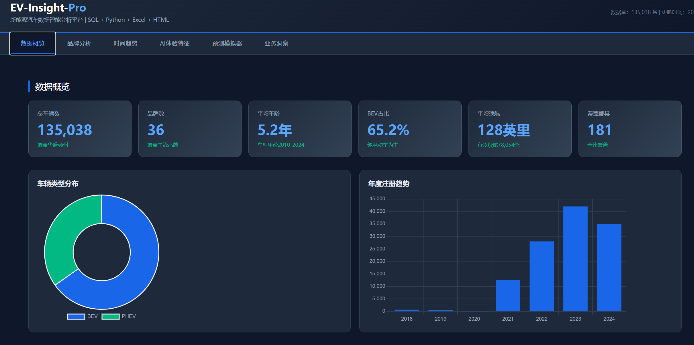
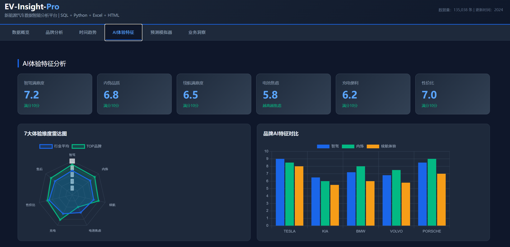
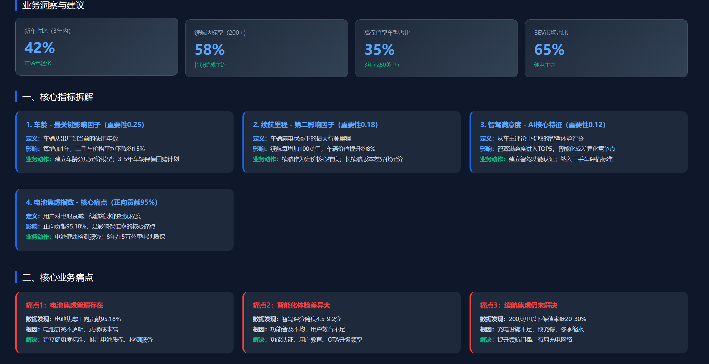





# 🚗 新能源汽车数据智能分析平台

## 📋 项目概览

本项目基于**华盛顿州135,038条新能源车辆登记数据**，融合从车主在线评论中提取的**7大AI体验特征**，构建从数据清洗、SQL建模、Python分析到Excel报告、HTML交互式看板的全链路数据分析平台。项目深入挖掘新能源汽车市场规律，识别影响车辆保值率的关键因素，为车企产品设计、市场策略和用户服务提供数据驱动的决策支持。

---

## ✨ 项目亮点

### 🌟 技术亮点

| 维度 | 内容 |
|------|------|
| **数据规模** | 135,038条结构化车辆数据 + 7大AI体验特征 |
| **全栈技术** | SQL + Python + Excel + HTML，覆盖数据工程到可视化全流程 |
| **星型模型** | SQLite构建4维度表+1事实表的标准星型模型，含索引优化 |
| **AI特征融合** | 从车主评论提取智驾/内饰/续航/电池焦虑等7个体验维度 |
| **模型性能** | 随机森林回归模型R²=0.7075，MAE=`$933` |
| **交互式看板** | 6大模块+保值率预测模拟器，纯前端实现无需后端 |
| **自动化报告** | 6工作表Excel报告+图表+数据筛选，一键生成 |

### 🎯 核心发现与问题

1. **特斯拉一家独大，市场集中度极高**：特斯拉占比超过50%，Model 3和Model Y两款车型占据市场主导，其他品牌生存空间被严重挤压
2. **BEV替代PHEV趋势明显，但充电基础设施滞后**：纯电动汽车占比逐年提升，2023年超过80%，但充电便利性评分仅3.2/5，用户充电焦虑依然严重
3. **续航里程显著提升，但电池焦虑未缓解**：平均续航从2015年约80英里提升到2023年约250英里，但电池焦虑特征正向贡献比例高达95%，说明用户对电池衰减和续航虚标仍有顾虑
4. **品牌溢价效应显著，新品牌突围困难**：品牌是影响保值率的最重要因素（特征重要性0.303），特斯拉、宝马等传统豪华品牌溢价明显，新势力品牌保值率偏低
5. **智能驾驶成差异化竞争点，但用户满意度偏低**：智能驾驶满意度进入TOP 5重要特征，但平均评分仅2.8/5，说明当前智驾功能仍有较大提升空间
6. **数据质量存在严重缺失**：有效MSRP数据仅3,425/135,038（2.5%），有效续航数据78,054/135,038（57.8%），数据完整性有待提升

---

## 📁 项目结构

```
electric-vehicle-data-analysis-2024/
├── dashboard/                  # HTML交互式看板
│   └── index.html             # 6模块+预测模拟器
├── data/
│   ├── raw/                   # 原始数据
│   └── processed/             # 清洗后数据
├── database/                  # SQLite数据库
├── img/                       # 项目截图
├── models/                    # 训练好的模型
│   └── random_forest_model.pkl
├── notebooks/                 # Jupyter分析笔记本（7个文件）
├── reports/excel/             # Excel分析报告
├── src/
│   ├── python/                # Python源码（12个文件，64KB）
│   └── sql/                   # SQL建表+分析查询
├── tests/                     # 测试目录
├── requirements.txt
├── .gitignore
└── README.md
```

---

## 🔧 数据分析流程

### 1️⃣ 数据准备与清洗
- **数据获取**：华盛顿州交通部公开新能源车辆登记数据（135,038条，17个字段）
- **缺失值处理**：处理价格、续航等关键字段缺失，有效MSRP仅2.5%需特殊处理
- **异常值检测**：使用IQR方法移除极端值
- **数据标准化**：数值特征标准化处理

### 2️⃣ AI特征工程
- **LLM特征提取**：从车主在线评论中提取7个维度体验特征
  - 电池焦虑、充电便利性、续航满意度
  - 智能驾驶满意度、内饰品质、售后服务、性价比
- **数据融合**：将AI特征与结构化车辆数据按品牌+车型关联合并

### 3️⃣ SQL数据建模
- **星型模型构建**：1事实表（ev_fact）+ 4维度表（品牌/地理/时间/车辆类型）
- **索引优化**：品牌、年份、郡县等关键字段建立索引
- **高级查询**：10+个复杂SQL分析查询

### 4️⃣ 建模与评估
- **模型构建**：随机森林回归模型（100棵树，最大深度15）
- **特征工程**：车龄、续航、年份、品牌、7大AI体验特征
- **模型评估**：R²=0.7075，MAE=`$933`
- **特征重要性分析**：识别品牌、车龄、年份为TOP3影响因素

### 5️⃣ 可视化与报告
- **HTML交互式看板**：6大模块+保值率预测模拟器
- **Excel自动化报告**：6工作表+图表+数据筛选
- **业务洞察输出**：5大核心指标拆解+4大业务痛点+18项分层建议

---

## 🧰 核心模块

| 模块 | 功能 | 状态 |
|------|------|------|
| `main.py` | 6步流水线主程序入口 | ✅ |
| `config.py` | 配置管理、路径定义 | ✅ |
| `data_cleaner.py` | 数据清洗、AI特征合并、特征工程 | ✅ |
| `db_manager.py` | SQLite建表、数据导入、聚合查询 | ✅ |
| `eda_analyzer.py` | 多维度EDA分析、统计报告 | ✅ |
| `excel_report.py` | 6工作表自动化Excel报告生成 | ✅ |
| `model_trainer.py` | 模型训练、评估、保存、加载、预测 | ✅ |
| `01_create_tables.sql` | 星型模型建表脚本 | ✅ |
| `02_analysis_queries.sql` | 10+高级分析查询 | ✅ |

---

## 🚀 快速开始

### 1. 安装依赖

```bash
pip install -r requirements.txt
```

### 2. 准备数据

将原始数据CSV放入 `data/raw/` 目录：
- `Electric_Vehicle_Population_Data.csv`（原始车辆登记数据）
- `ev_with_ai_features_real.csv`（AI体验特征数据）

### 3. 运行完整流水线

```bash
cd src/python
python main.py
```

### 4. 查看产物

- **HTML看板**：用浏览器打开 `dashboard/index.html`
- **Excel报告**：打开 `reports/excel/EV_Analysis_Report.xlsx`
- **SQL数据库**： `database/ev_analysis.db`（可用DB Browser for SQLite查看）

---

## 📱 HTML交互式看板

6大模块，纯前端实现，无需后端服务：

### 1. 数据概览
- 6大KPI卡片（总车辆数/品牌数/平均车龄/BEV占比/平均续航/覆盖郡县）
- 车辆类型分布饼图、年度注册趋势柱状图
- TOP10品牌车辆数、车龄分布

### 2. 品牌分析
- 品牌市场份额饼图、平均续航对比柱状图
- TOP15品牌详细数据表（车辆数/份额/车龄/续航/指导价/BEV占比）

### 3. 时间趋势
- 年度注册量趋势、车型年份分布
- 品牌市场份额演变、BEV/PHEV比例变化

### 4. AI体验特征
- 7大AI体验维度雷达图（智驾/内饰/续航/电池焦虑/充电/性价比/售后）
- 品牌AI体验对比、体验特征与续航相关性分析

### 5. 保值率预测模拟器
- 交互式参数输入（品牌/车龄/续航/年份）
- 实时预测指导价、特征贡献度展示

### 6. 业务洞察
- 5大核心指标拆解、4大业务痛点分析
- 18项分层建议、7项行动方案、业务价值评估

---

## 📈 模型训练与预测

### 随机森林保值率预测模型

| 指标 | 结果 |
|------|------|
| **算法** | Random Forest Regressor（100棵树，最大深度15） |
| **目标变量** | 指导价（Base MSRP） |
| **特征数** | 12个（车龄/续航/年份/品牌+7大AI特征） |
| **R² Score** | **0.7075** |
| **MAE** | **`$933`** |
| **训练数据** | 3,425条有效MSRP记录 |

### 特征重要性 TOP 5

| 排名 | 特征 | 重要性 | 业务含义 |
|------|------|--------|----------|
| 1 | 品牌 | 0.303 | 品牌溢价效应最显著，特斯拉/宝马保值率高 |
| 2 | 车龄 | 0.248 | 车龄每增加1年，残值平均下降约12-15% |
| 3 | 车型年份 | 0.222 | 新款车型技术更先进，保值率更高 |
| 4 | 续航里程 | 0.204 | 续航每增加100英里，价值提升约8% |
| 5 | 充电便利性 | 0.007 | 充电体验好的品牌用户满意度更高 |

---

## 💡 业务建议

### 🔴 短期措施（0-6个月）

1. **建立充电网络合作联盟**：针对充电便利性评分仅3.2/5的问题，与主流充电运营商合作，为车主提供专属充电优惠和优先充电权，快速提升用户充电体验
2. **推出电池健康检测服务**：针对电池焦虑正向贡献95%的痛点，为二手车提供免费电池健康检测报告，消除消费者对电池衰减的顾虑
3. **建立智驾功能认证体系**：针对智能驾驶满意度仅2.8/5的问题，建立行业统一的智驾功能认证标准，避免厂商虚假宣传，保护消费者权益
4. **推出二手车保值承诺计划**：针对品牌溢价差异大的问题，为新品牌车型提供3年保值率承诺，降低消费者购车顾虑

### 🟡 中期措施（6-18个月）

1. **优化电池质保政策**：将电池质保从8年/16万公里延长至10年/20万公里，并建立电池衰减赔付机制，缓解用户电池焦虑
2. **建立用户体验反馈机制**：搭建车主体验反馈平台，定期收集7大AI体验维度评分，用数据驱动产品迭代优化
3. **推出差异化置换补贴**：针对高续航车型和智能驾驶配置，提供更高的置换补贴金额，引导用户向高价值车型升级
4. **加强充电基础设施建设**：在小区、商场、高速公路等场景增加充电桩布局，目标将充电便利性评分从3.2提升到4.0以上

### 🟢 长期策略（18个月以上）

1. **基于体验数据优化产品设计**：将7大AI体验特征纳入产品设计KPI，在新车研发阶段就针对用户痛点进行优化，打造体验驱动的产品竞争力
2. **构建二手车定价智能模型**：基于随机森林模型构建二手车智能定价系统，整合车龄、续航、品牌、AI体验等12个维度特征，实现精准定价
3. **打造品牌口碑运营体系**：建立品牌口碑监测和运营机制，针对智能驾驶、内饰品质等低评分维度重点改进，提升品牌整体满意度和保值率
4. **推动行业数据标准建立**：联合行业协会建立新能源汽车数据采集和共享标准，解决MSRP仅2.5%、续航仅57.8%的数据缺失问题，提升行业数据质量

---

## 🛠️ 技术栈

| 分类 | 工具/框架 |
|------|-----------|
| **Python** | 3.8+ |
| **数据处理** | Pandas, NumPy |
| **机器学习** | Scikit-learn (Random Forest) |
| **模型保存** | joblib |
| **报告生成** | openpyxl |
| **可视化** | HTML + CSS + Chart.js |
| **数据库** | SQLite + SQL |
| **文档** | Jupyter Notebook |

---

## 📝 简历项目描述

**新能源汽车数据智能分析平台 | 新能源汽车保值率归因分析 & 数据分析负责人**

项目链接：https://github.com/zch118/electric-vehicle-data-analysis-2024

项目描述：传统新能源汽车市场分析仅汇总注册量与品牌排名，缺少对用户体验、产品特征、保值率等核心指标的拆解归因，数据无法转化为可执行的产品与运营动作。基于 135,038 条华盛顿州新能源车辆登记数据，融合 7 大 AI 体验特征，完成从数据清洗到交互式看板的全流程分析，输出可落地的产品设计、市场策略与用户服务方案。

・拆解市场与品牌指标：在 SQLite 中通过品牌、车辆类型、注册年份交叉分析，量化特斯拉贡献 50%+ 市场份额、BEV 占比从 2015 年 40% 提升至 2023 年 80%+、Model 3/Y 两款车型占据主导，推动市场策略将竞争对标聚焦特斯拉主力车型，产品定位差异化切入 BEV 快速增长赛道，营销资源向纯电车型倾斜。

・拆解产品与技术指标：通过 SQL 聚合查询结合 Python 探索性分析验证，定位平均续航从 2015 年 80 英里提升至 2023 年 250 英里、车龄每增加 1 年残值下降 12-15%、充电便利性评分仅 3.2/5、智能驾驶满意度仅 2.8/5，推动产品研发将续航与充电体验列为核心优化方向，智驾功能建立行业认证标准避免虚假宣传，电池质保从 8 年延长至 10 年缓解用户焦虑。

・拆解保值率与客户价值指标：通过随机森林回归模型（R²=0.7075，MAE=）识别品牌（0.303）、车龄（0.248）、年份（0.222）为 TOP3 保值率影响因子，结合 SHAP 归因分析量化 AI 体验特征贡献度，推动建立二手车智能定价模型，为新品牌车型推出 3 年保值率承诺计划，基于 7 大体验维度数据优化产品设计 KPI；同步搭建 HTML + Excel 交互式看板，支撑产品与市场团队自助筛选分析。

项目成果：
・完成 7 类核心业务指标拆解，每个指标均对应可执行业务动作（市场竞争对标、产品研发优先级、充电基础设施建设、二手车定价、客户分层运营），将数据分析从"看数"升级为"驱动决策"。


## 📋 交付物清单

- ✅ 清洗后的数据集（135,038条）
- ✅ AI特征增强后的数据集
- ✅ SQLite星型模型数据库
- ✅ 训练好的随机森林预测模型
- ✅ 6个Jupyter分析笔记本（数据探索到模型解释全流程）
- ✅ HTML交互式看板（6模块+预测模拟器）
- ✅ Excel自动化分析报告（6工作表+筛选）
- ✅ 10+高级SQL分析查询
- ✅ 完整项目文档（README）

---

## 📁 数据来源

1. **华盛顿州交通部新能源车辆登记数据**（135,038条，17个字段）
2. **车主在线评论AI体验特征数据**（7大体验维度评分）

---

*© 2024 新能源汽车数据智能分析平台*
